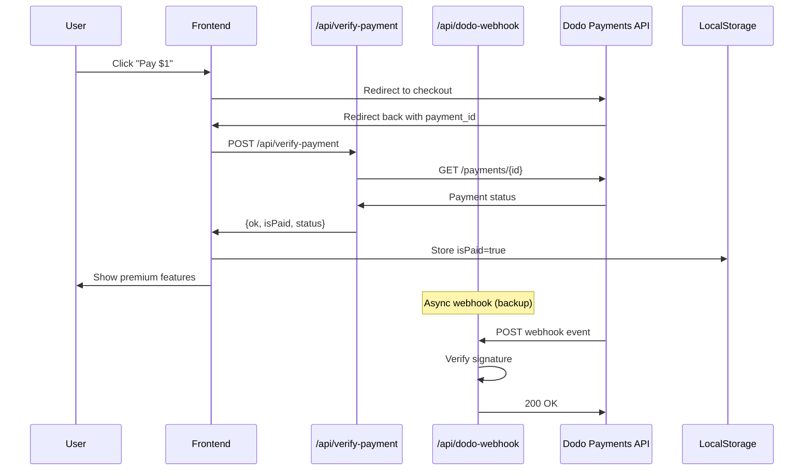

# Design Document: Fix Dodo Payments Integration

## Overview

This design addresses the broken Dodo Payments integration in HireSchema. The current implementation has several critical issues:

1. **Webhook signature verification uses incorrect algorithm** - Dodo uses base64-encoded HMAC-SHA256 signatures with a specific format
2. **In-memory payment store** - The `_paymentsStore.ts` uses a Map that resets on serverless cold starts
3. **Checkout URL construction** - May use incorrect parameter names for the return URL

The solution focuses on:
- Fixing the webhook signature verification to match Dodo's format
- Removing the unreliable in-memory store and relying on direct API verification
- Ensuring the checkout URL uses correct Dodo parameters
- Improving error handling and user feedback

## Architecture



## Components and Interfaces

### 1. Payment Service (Frontend)

**File:** `services/paymentService.ts`

```typescript
interface VerifyPaymentResult {
  ok: boolean;
  isPaid: boolean;
  status?: string;
  product_id?: string | null;
  code?: number;
  reason?: string;
}

// Verify payment via backend API
function verifyDodoPayment(paymentId: string): Promise<VerifyPaymentResult>

// Build checkout URL with correct parameters
function buildCheckoutUrl(productId: string, returnUrl: string): string
```

### 2. Verify Payment API (Backend)

**File:** `api/verify-payment.ts`

```typescript
// POST /api/verify-payment
// Body: { paymentId: string }
// Response: { ok: boolean, isPaid: boolean, status?: string, product_id?: string }

interface DodoPaymentResponse {
  payment_id: string;
  status: 'succeeded' | 'pending' | 'failed' | 'cancelled';
  product_id?: string;
  customer_id?: string;
  amount?: number;
  currency?: string;
}
```

### 3. Webhook Handler (Backend)

**File:** `api/dodo-webhook.ts`

```typescript
// POST /api/dodo-webhook
// Headers: webhook-id, webhook-signature, webhook-timestamp
// Body: Dodo webhook payload

interface DodoWebhookPayload {
  type: string;
  data: {
    payment_id: string;
    status: string;
    product_id?: string;
  };
}

// Signature format: "v1,<base64-signature>"
function verifyWebhookSignature(
  payload: string,
  signature: string,
  timestamp: string,
  webhookId: string,
  secret: string
): boolean
```

### 4. Payment Lock Component (Frontend)

**File:** `components/PaymentLock.tsx`

No interface changes needed, but implementation updates for:
- Correct checkout URL construction
- Better error messages
- Retry logic improvements

## Data Models

### Payment Verification Response

```typescript
interface VerifyPaymentResponse {
  ok: boolean;           // API call succeeded
  isPaid: boolean;       // Payment is confirmed
  status?: string;       // Raw status from Dodo
  product_id?: string;   // Product ID for validation
  reason?: string;       // Error reason if failed
  code?: number;         // HTTP status code if error
}
```

### Webhook Event Types

```typescript
type DodoEventType = 
  | 'payment.succeeded'
  | 'payment.failed'
  | 'payment.pending'
  | 'refund.succeeded';
```

## Correctness Properties

*A property is a characteristic or behavior that should hold true across all valid executions of a system-essentially, a formal statement about what the system should do. Properties serve as the bridge between human-readable specifications and machine-verifiable correctness guarantees.*

### Property 1: Checkout URL contains required parameters
*For any* product ID and return URL, the constructed checkout URL SHALL contain the product ID in the path and the return URL as an encoded query parameter.
**Validates: Requirements 1.1**

### Property 2: Successful payment verification updates state
*For any* payment verification response where status is "succeeded", the isPaid flag SHALL be set to true and localStorage SHALL contain "hireSchema_isPaid" = "true".
**Validates: Requirements 1.3, 2.2**

### Property 3: Failed verification returns appropriate error
*For any* payment verification response where status is not "succeeded" or API returns error, the result SHALL contain isPaid=false and a descriptive reason.
**Validates: Requirements 2.3**

### Property 4: Webhook signature verification round-trip
*For any* valid webhook payload, signing it with the secret and then verifying with the same secret SHALL return true. Verifying with a different secret SHALL return false.
**Validates: Requirements 3.1**

### Property 5: Invalid webhook signatures are rejected
*For any* webhook request with an invalid or missing signature, the handler SHALL return a 400 status code.
**Validates: Requirements 3.3**

### Property 6: Environment-based URL construction
*For any* DODO_ENV value, the API base URL SHALL be "test.dodopayments.com" when env is "test", and "live.dodopayments.com" otherwise.
**Validates: Requirements 4.1, 4.2**

### Property 7: Payment state persistence round-trip
*For any* successful payment verification, storing the state and then reading it back SHALL return the same isPaid value.
**Validates: Requirements 5.1, 5.3**

## Error Handling

### Frontend Errors

| Error Condition | User Message | Action |
|----------------|--------------|--------|
| Missing payment_id in URL | "Payment verification failed. Please enter Payment ID manually." | Show manual input |
| API returns isPaid=false | "Payment not completed. Please complete payment or try again." | Show retry option |
| Network error | "Network error. Please check your connection and try again." | Show retry button |
| Too many attempts | "Too many failed attempts. Please refresh the page." | Lock form |

### Backend Errors

| Error Condition | HTTP Status | Response |
|----------------|-------------|----------|
| Missing paymentId | 400 | `{ ok: false, error: "Missing paymentId" }` |
| Missing API key | 500 | `{ ok: false, reason: "Server misconfiguration" }` |
| Dodo API error | 502 | `{ ok: false, reason: "Payment service unavailable" }` |
| Invalid webhook signature | 400 | `{ error: "Invalid signature" }` |

## Testing Strategy

### Unit Tests

1. **Checkout URL Builder**
   - Test URL contains product ID
   - Test return URL is properly encoded
   - Test with special characters in return URL

2. **Webhook Signature Verification**
   - Test valid signature passes
   - Test invalid signature fails
   - Test missing headers handled

3. **Environment URL Selection**
   - Test "test" env uses test URL
   - Test "live" env uses live URL
   - Test default (undefined) uses live URL

### Property-Based Tests

The project will use **fast-check** for property-based testing in TypeScript.

Each property-based test MUST:
- Run a minimum of 100 iterations
- Be tagged with a comment referencing the correctness property: `**Feature: fix-dodo-payments, Property {number}: {property_text}**`
- Test the property across randomly generated valid inputs

**Property Tests to Implement:**

1. **Property 1**: Generate random product IDs and URLs, verify checkout URL structure
2. **Property 4**: Generate random payloads and secrets, verify sign-then-verify succeeds
3. **Property 5**: Generate random invalid signatures, verify all are rejected
4. **Property 6**: Generate random env values, verify correct URL selection
5. **Property 7**: Generate random payment states, verify localStorage round-trip
