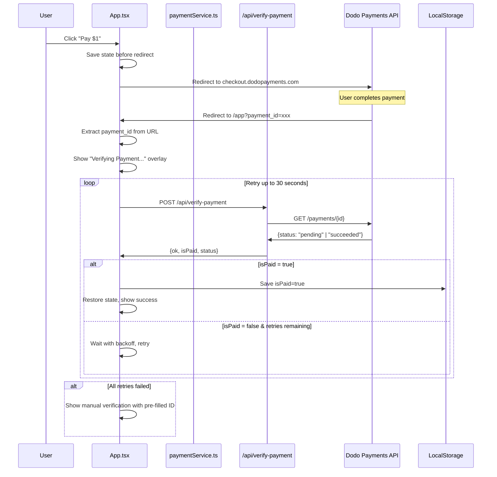

# Design Document: Fix Dodo Payments Verification Flow

## Overview

This design addresses the critical issue where successful Dodo payments always show "Payment is being processed" instead of confirming success. 

### Root Cause

After thorough code analysis, the root cause is a **combination of issues**:

1. **Redirect Parameter Extraction**: The app looks for `payment_id` in URL params, but Dodo may use different parameter names or URL structures
2. **Insufficient Retry Logic**: Current 3 retries (2s, 4s, 8s = 14s total) may not be enough for Dodo's payment propagation
3. **No Fallback for Empty Payment ID**: When no payment ID is found in URL, the user gets stuck

### Solution Approach

1. **Robust Parameter Extraction**: Check all possible Dodo redirect parameter names
2. **Extended Polling**: Up to 30 seconds with smarter backoff
3. **Better UX**: Show payment ID for manual entry if auto-verification fails
4. **Debug Logging**: Add comprehensive logging to diagnose issues in production

## Architecture



## Components and Interfaces

### 1. Payment Verification Flow (Frontend)

**File:** `App.tsx`

Changes needed:
- Extract payment ID using comprehensive parameter list
- Implement extended retry logic (30 seconds total)
- Pre-fill payment ID in manual verification if auto fails
- Add debug logging for production troubleshooting

```typescript
// Extended parameter extraction
const DODO_PAYMENT_PARAMS = [
  'payment_id',
  'paymentId', 
  'id',
  'checkout_id',
  'session_id',
  'order_id'
];

// Extended retry configuration
const RETRY_CONFIG = {
  maxDuration: 30000,  // 30 seconds total
  delays: [1000, 2000, 3000, 4000, 5000, 5000, 5000, 5000]  // 8 retries
};
```

### 2. Payment Service (Frontend)

**File:** `services/paymentService.ts`

No major changes needed - current implementation is correct.

### 3. Verify Payment API (Backend)

**File:** `api/verify-payment.ts`

Current implementation is correct. The API:
- Validates payment ID format
- Calls Dodo API with proper authentication
- Falls back to alternate environment if needed
- Returns clear error reasons

### 4. PaymentLock Component

**File:** `components/PaymentLock.tsx`

Changes needed:
- Accept pre-filled payment ID prop
- Show payment ID when passed from failed auto-verification

## Data Models

### Verification State

```typescript
interface VerificationState {
  isVerifying: boolean;
  attemptCount: number;
  lastError: string | null;
  extractedPaymentId: string | null;  // For pre-filling manual input
}
```

### Retry Configuration

```typescript
interface RetryConfig {
  maxDuration: number;      // Maximum total time to retry (ms)
  delays: number[];         // Delay between each retry (ms)
  onRetry?: (attempt: number, elapsed: number) => void;
}
```

## Correctness Properties

*A property is a characteristic or behavior that should hold true across all valid executions of a system-essentially, a formal statement about what the system should do. Properties serve as the bridge between human-readable specifications and machine-verifiable correctness guarantees.*

### Property 1: Payment ID extraction covers all Dodo parameters
*For any* redirect URL from Dodo containing a payment identifier, the extraction function SHALL return the payment ID regardless of which parameter name Dodo uses.
**Validates: Requirements 1.2**

### Property 2: Retry logic respects maximum duration
*For any* verification attempt, the total retry duration SHALL NOT exceed the configured maximum (30 seconds), and each retry SHALL use the configured delay.
**Validates: Requirements 2.2**

### Property 3: Successful payment always navigates to premium state
*For any* successful payment verification, the application SHALL navigate to a state where premium features are accessible, regardless of whether previous analysis state exists.
**Validates: Requirements 1.5, 1.6**
