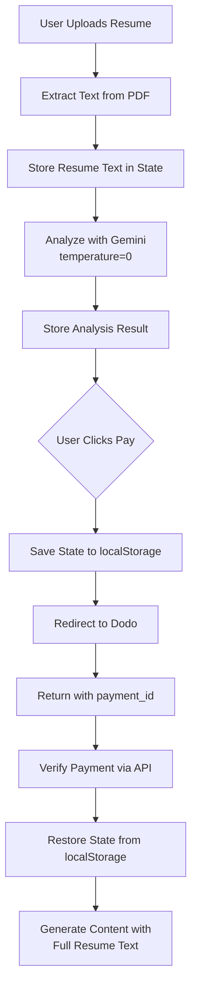

# Design Document: Improve Analysis Consistency and Security

## Overview

This design addresses three critical issues in HireSchema:

1. **Inconsistent analysis results** - The Gemini AI uses default temperature settings, causing different results each time
2. **Security vulnerabilities** - Dev backdoor and localStorage manipulation can bypass payment
3. **Lost state after payment** - Resume data isn't properly passed to content generation after payment redirect

## Architecture



## Components and Interfaces

### 1. Gemini Service Updates

**File:** `services/geminiService.ts`

```typescript
// Add temperature=0 for deterministic output
const GENERATION_CONFIG = {
  temperature: 0,
  topP: 1,
  topK: 1,
};

// Store extracted resume text for later use
interface ResumeAnalysisContext {
  resumeText: string;
  jobDescription: string;
  analysisResult: AnalysisResult;
}
```

### 2. State Persistence Service

**File:** `services/stateService.ts` (new)

```typescript
interface PersistedState {
  resumeFile: FileData;
  resumeText: string;  // Extracted text for content generation
  jobDescription: string;
  analysisResult: AnalysisResult;
  timestamp: number;
}

function saveStateBeforePayment(state: PersistedState): void
function restoreStateAfterPayment(): PersistedState | null
function clearPersistedState(): void
```

### 3. Payment Security Updates

**File:** `components/PaymentLock.tsx`

- Remove dev backdoor in production
- Add environment check for backdoor

**File:** `api/verify-payment.ts`

- Add payment ID format validation
- Reject obviously invalid IDs before API call

## Data Models

### Persisted State

```typescript
interface PersistedState {
  resumeFile: FileData;
  resumeText: string;
  jobDescription: string;
  analysisResult: AnalysisResult;
  timestamp: number;
}
```

### Payment ID Validation

```typescript
// Valid Dodo payment IDs are typically:
// - UUID format: xxxxxxxx-xxxx-xxxx-xxxx-xxxxxxxxxxxx
// - Or alphanumeric strings of 20-50 characters
const PAYMENT_ID_PATTERN = /^[a-zA-Z0-9_-]{10,60}$/;
```

## Correctness Properties

*A property is a characteristic or behavior that should hold true across all valid executions of a system-essentially, a formal statement about what the system should do. Properties serve as the bridge between human-readable specifications and machine-verifiable correctness guarantees.*

### Property 1: Payment ID format validation
*For any* payment ID string, the validation function SHALL return false for strings that don't match the expected format (alphanumeric, 10-60 characters).
**Validates: Requirements 2.3**

### Property 2: Resume text inclusion in prompts
*For any* content generation request with a non-empty resume text, the generated prompt SHALL contain the resume text content.
**Validates: Requirements 3.4**

### Property 3: State persistence round-trip
*For any* valid persisted state, saving and then restoring SHALL return an equivalent state object.
**Validates: Requirements 3.1, 3.2**

## Error Handling

### State Restoration Errors

| Error Condition | Action |
|----------------|--------|
| No persisted state found | Start fresh analysis flow |
| Corrupted state data | Clear state, show error message |
| Expired state (>24h old) | Clear state, prompt re-upload |

### Payment Validation Errors

| Error Condition | Response |
|----------------|----------|
| Invalid payment ID format | 400 - "Invalid payment ID format" |
| Empty payment ID | 400 - "Missing payment ID" |

## Testing Strategy

### Unit Tests

1. **Payment ID Validation**
   - Test valid UUID format passes
   - Test valid alphanumeric format passes
   - Test empty string fails
   - Test special characters fail

2. **State Persistence**
   - Test save/restore round-trip
   - Test expired state handling
   - Test corrupted data handling

### Property-Based Tests

The project will use **fast-check** for property-based testing.

Each property-based test MUST:
- Run a minimum of 100 iterations
- Be tagged with: `**Feature: improve-analysis-consistency, Property {number}: {property_text}**`

**Property Tests to Implement:**

1. **Property 1**: Generate random strings, verify validation correctly identifies invalid formats
2. **Property 2**: Generate random resume texts, verify they appear in prompts
3. **Property 3**: Generate random state objects, verify save/restore preserves data
