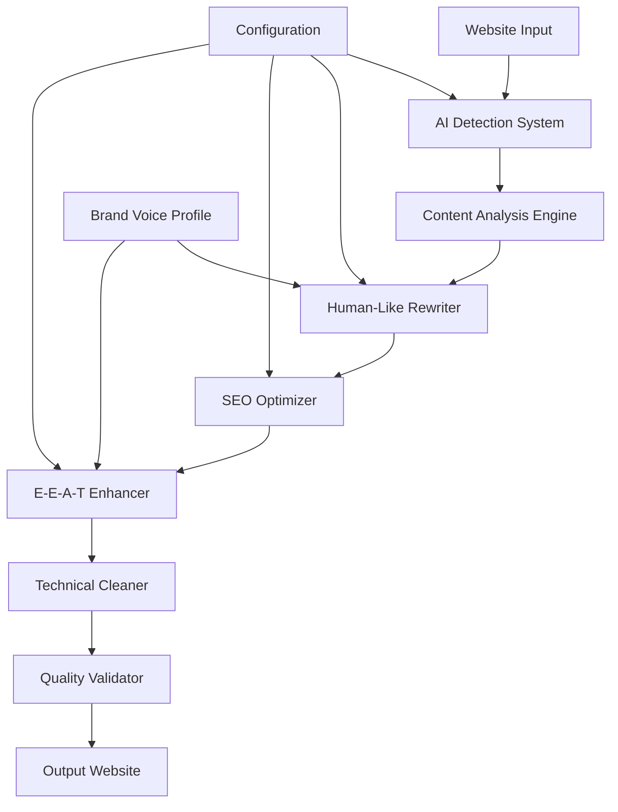

# Design Document: Website AI Signal Removal & E-E-A-T Enhancement

## Overview

This system performs comprehensive website auditing and content rewriting to eliminate AI-generated content signals while strengthening SEO performance and Google E-E-A-T signals. The solution transforms content-heavy websites into credible, human-authored authority sites suitable for SaaS/personal brand/niche expert positioning.

The system operates through a multi-stage pipeline: AI detection, content analysis, human-like rewriting, SEO optimization, E-E-A-T enhancement, and technical cleanup. Each stage builds upon the previous to ensure comprehensive transformation while preserving search rankings and improving user trust signals.

## Architecture

The system follows a modular pipeline architecture with six core processing stages:



### Processing Flow

1. **Input Stage**: Website crawling and content extraction
2. **Detection Stage**: AI pattern identification and confidence scoring
3. **Analysis Stage**: Content structure and quality assessment
4. **Rewriting Stage**: Human-like content transformation
5. **Optimization Stage**: SEO preservation and enhancement
6. **Enhancement Stage**: E-E-A-T signal strengthening
7. **Cleanup Stage**: Technical AI trace removal
8. **Validation Stage**: Quality assurance and testing

## Components and Interfaces

### AI Detection System

**Purpose**: Identifies AI-generated content patterns across website pages

**Core Detection Patterns**:
- Repetitive sentence structures and uniform length (12-18 words)
- Generic phrasing and buzzword clusters
- Overly polished tone lacking natural variation
- Predictable paragraph organization
- Low "burstiness" (lack of sentence length variation)
- High "perplexity" scores indicating unnatural complexity patterns

**Interface**:
```typescript
interface AIDetectionSystem {
  scanPage(url: string): AIDetectionReport
  analyzeContent(content: string): AISignalScore[]
  identifyPatterns(text: string): DetectedPattern[]
  generateConfidenceScore(signals: AISignal[]): number
}

interface AIDetectionReport {
  pageUrl: string
  overallConfidence: number
  detectedSignals: AISignal[]
  flaggedSections: ContentSection[]
  recommendations: string[]
}
```

### Content Analysis Engine

**Purpose**: Analyzes content structure, quality, and optimization opportunities

**Analysis Capabilities**:
- Content depth and topical authority assessment
- Keyword density and semantic analysis
- Readability and engagement metrics
- E-E-A-T signal presence evaluation
- Brand voice consistency measurement

**Interface**:
```typescript
interface ContentAnalysisEngine {
  analyzeStructure(content: string): StructureAnalysis
  assessQuality(content: string): QualityMetrics
  evaluateEEAT(content: string): EEATAssessment
  identifyKeywords(content: string): KeywordAnalysis
}
```

### Human-Like Rewriter

**Purpose**: Transforms AI-flagged content into naturally human writing

**Rewriting Strategies**:
- Sentence length variation (mix of 5-25 word sentences)
- Conversational tone injection with personal opinions
- Specific example replacement for generic statements
- Natural paragraph flow with logical transitions
- First-person experience integration
- Industry-specific terminology and insights

**Interface**:
```typescript
interface HumanLikeRewriter {
  rewriteContent(content: string, brandVoice: BrandVoiceProfile): string
  varysentenceStructure(text: string): string
  injectPersonality(content: string, voice: VoiceProfile): string
  addSpecificExamples(genericText: string, context: ContentContext): string
  enhanceNaturalFlow(content: string): string
}

interface BrandVoiceProfile {
  toneAttributes: string[]
  personalityTraits: string[]
  expertiseAreas: string[]
  preferredPhrasing: string[]
  avoidedTerms: string[]
}
```

### SEO Optimizer

**Purpose**: Maintains and enhances search engine optimization during rewriting

**Optimization Features**:
- Keyword preservation and natural placement
- Semantic keyword integration
- Heading structure optimization
- Meta description enhancement
- Internal linking opportunities
- Topical authority strengthening

**Interface**:
```typescript
interface SEOOptimizer {
  preserveKeywords(originalContent: string, rewrittenContent: string): boolean
  optimizeHeadings(headings: string[]): string[]
  enhanceTopicalDepth(content: string, topic: string): string
  validateKeywordDensity(content: string, keywords: string[]): boolean
}
```

### E-E-A-T Enhancer

**Purpose**: Strengthens Google's Experience, Expertise, Authoritativeness, and Trust signals

**Enhancement Strategies**:
- **Experience**: First-hand anecdotes, case studies, personal insights
- **Expertise**: Technical depth, industry knowledge, professional credentials
- **Authoritativeness**: Confident opinions, thought leadership, citation-worthy content
- **Trustworthiness**: Transparency, accuracy, credibility markers, author bio

**Interface**:
```typescript
interface EEATEnhancer {
  enhanceExperience(content: string): string
  strengthenExpertise(content: string, domain: string): string
  buildAuthority(content: string, authorProfile: AuthorProfile): string
  improveTrust(content: string): string
  validateEEATSignals(content: string): EEATScore
}

interface EEATScore {
  experience: number
  expertise: number
  authoritativeness: number
  trustworthiness: number
  overall: number
}
```

### Technical Cleaner

**Purpose**: Removes all technical traces of AI generation

**Cleanup Operations**:
- Metadata and schema markup cleaning
- HTML comment removal
- AI provider reference elimination
- Generation timestamp removal
- Source code trace cleanup

**Interface**:
```typescript
interface TechnicalCleaner {
  cleanMetadata(pageData: PageData): PageData
  removeAIReferences(htmlContent: string): string
  cleanSchemaMarkup(schema: SchemaData): SchemaData
  validateCleanup(pageData: PageData): boolean
}
```

## Data Models

### Content Models

```typescript
interface WebsitePage {
  url: string
  title: string
  content: string
  metadata: PageMetadata
  htmlStructure: HTMLElement[]
  lastModified: Date
}

interface ContentSection {
  id: string
  type: 'heading' | 'paragraph' | 'list' | 'quote'
  content: string
  aiConfidence: number
  keywords: string[]
  eeAtSignals: EEATSignal[]
}

interface AISignal {
  type: 'repetitive_structure' | 'generic_phrasing' | 'buzzwords' | 'uniform_length'
  confidence: number
  location: TextLocation
  description: string
  suggestion: string
}
```

### Quality Models

```typescript
interface QualityMetrics {
  readabilityScore: number
  engagementPotential: number
  naturalness: number
  brandVoiceAlignment: number
  seoOptimization: number
  eeAtStrength: number
}

interface ValidationResult {
  aiDetectionPassed: boolean
  seoPreserved: boolean
  qualityImproved: boolean
  eeAtEnhanced: boolean
  technicallyClean: boolean
  overallScore: number
}
```

## Correctness Properties

*A property is a characteristic or behavior that should hold true across all valid executions of a system—essentially, a formal statement about what the system should do. Properties serve as the bridge between human-readable specifications and machine-verifiable correctness guarantees.*

Now I need to use the prework tool to analyze the acceptance criteria before writing the correctness properties.

### Property 1: AI Pattern Detection Completeness
*For any* website page content, the AI Detection System should identify all AI-generated patterns including generic phrasing, repetitive structures, uniform tone, and buzzwords, generating a comprehensive report with confidence scores.
**Validates: Requirements 1.1, 1.2, 1.3, 1.4, 1.5**

### Property 2: Natural Writing Transformation
*For any* AI-flagged content, the Content Rewriter should transform it into human-like writing with varied sentence lengths, specific examples, natural flow, personal opinions, and experience cues while preserving original meaning.
**Validates: Requirements 2.1, 2.2, 2.3, 2.4, 2.5**

### Property 3: SEO Preservation and Enhancement
*For any* content rewrite, the SEO Optimizer should preserve all target keywords and semantic variations, maintain natural keyword placement, enhance topical depth without stuffing, and improve authority signals.
**Validates: Requirements 3.1, 3.2, 3.3, 3.4, 3.5**

### Property 4: E-E-A-T Signal Strengthening
*For any* content enhancement, the E-E-A-T Enhancer should inject first-hand experience indicators, add technical expertise depth, incorporate confident authority elements, improve trust signals, and establish clear author credibility.
**Validates: Requirements 4.1, 4.2, 4.3, 4.4, 4.5**

### Property 5: Brand Voice Consistency
*For any* content processing, the Brand Voice Processor should maintain confident non-salesy tone, inject personality while preserving professionalism, add opinionated perspectives, ensure helpful non-preachy tone, and create consistency across all page types.
**Validates: Requirements 5.1, 5.2, 5.3, 5.4, 5.5**

### Property 6: Technical AI Trace Elimination
*For any* website processing, the Technical Cleaner should remove all AI provider references, eliminate AI-related structured data, clean source code of AI indicators, and ensure content passes AI detection tools with human-like scores.
**Validates: Requirements 6.1, 6.2, 6.3, 6.4, 6.5**

### Property 7: Quality Validation Round-Trip
*For any* content processing, the system should preserve factual accuracy, improve readability and natural flow, pass AI detection tools as human-written, maintain SEO metrics, and generate comprehensive quality comparison reports.
**Validates: Requirements 7.1, 7.2, 7.3, 7.4, 7.5**

### Property 8: Comprehensive Site Coverage
*For any* website input, the system should process all page types (homepage, blog posts, landing pages, About pages, supporting pages) while maintaining their specific optimization goals and ensuring consistency across the entire site.
**Validates: Requirements 8.1, 8.2, 8.3, 8.4, 8.5**

## Error Handling

The system implements comprehensive error handling across all processing stages:

### Input Validation Errors
- Invalid URL formats or inaccessible websites
- Corrupted or malformed HTML content
- Missing essential page elements (title, content)
- Unsupported content types or formats

### Processing Errors
- AI detection failures or low confidence scores
- Content rewriting failures preserving meaning
- SEO optimization conflicts with naturalness
- E-E-A-T enhancement reducing readability
- Brand voice application inconsistencies

### Quality Validation Errors
- Content failing AI detection tools
- SEO metrics degradation after processing
- Factual accuracy loss during rewriting
- Readability score reduction
- Brand voice inconsistency across pages

### Recovery Strategies
- Graceful degradation with partial processing
- Rollback to previous processing stage
- Alternative rewriting approaches
- Manual review flagging for complex cases
- Confidence threshold adjustments

## Testing Strategy

The testing approach combines unit testing for specific functionality with property-based testing for universal correctness guarantees.

### Unit Testing Focus
- Specific AI pattern detection examples
- Edge cases in content rewriting
- SEO keyword preservation scenarios
- E-E-A-T signal injection examples
- Technical cleanup validation cases
- Integration between system components

### Property-Based Testing Configuration
- **Testing Library**: Hypothesis (Python) or fast-check (TypeScript)
- **Minimum Iterations**: 100 per property test
- **Test Data Generation**: Random website content, AI patterns, brand voice profiles
- **Property Test Tags**: Each test references its design document property

**Property Test Implementation Requirements**:
- Each correctness property implemented as a single property-based test
- Tests generate diverse input scenarios (different content types, lengths, structures)
- Validation includes both positive and negative test cases
- Performance benchmarks for processing speed and quality metrics
- Integration tests with real website examples

**Test Tag Format**:
```
Feature: website-ai-signal-removal, Property 1: AI Pattern Detection Completeness
Feature: website-ai-signal-removal, Property 2: Natural Writing Transformation
```

### Quality Assurance Metrics
- AI detection evasion rate (>95% human-like scores)
- SEO metric preservation (keyword rankings maintained)
- E-E-A-T signal improvement (measurable authority increase)
- Processing speed benchmarks (pages per minute)
- Content quality scores (readability, engagement potential)
- Brand voice consistency measurements across page types